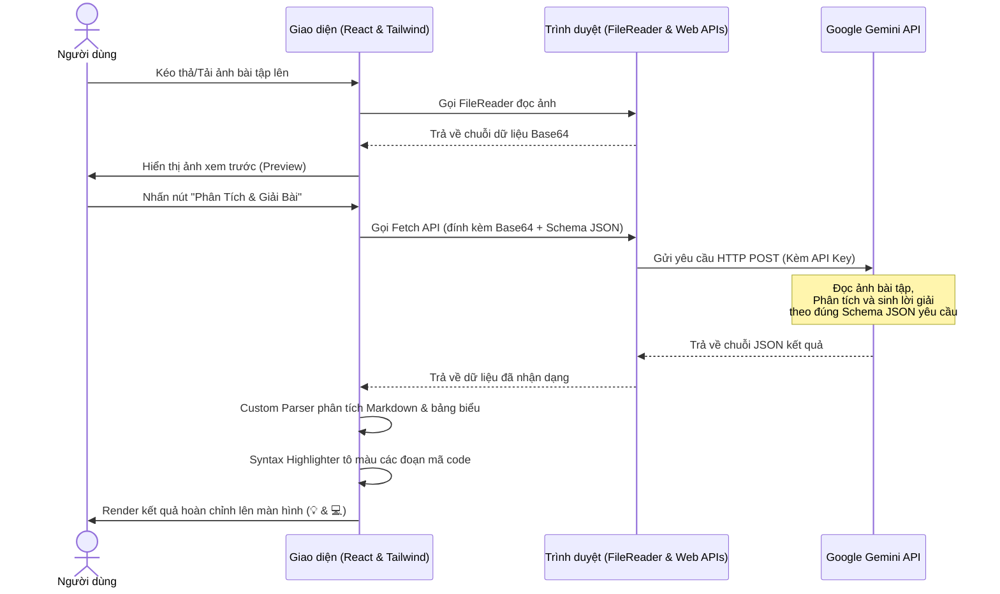

# DANH SÁCH & PHÂN TÍCH CÁC CÔNG NGHỆ SỬ DỤNG

Tài liệu này trình bày chi tiết và rõ ràng về các công nghệ, thư viện, giao thức và giải pháp kỹ thuật được áp dụng trong ứng dụng **Học Dễ Dàng - Trợ Lý Giải Bài Tập AI** (`giai_bai_tap.html`).

---

## 1. Tổng quan Kiến trúc Ứng dụng
Ứng dụng được xây dựng theo mô hình **Single Page Application (SPA)** chạy trực tiếp hoàn toàn ở phía máy khách (Client-side / Frontend-only) thông qua một file HTML duy nhất. 
*   **Không có máy chủ trung gian (Serverless/Backendless):** Các yêu cầu xử lý hình ảnh và gọi AI được thực hiện trực tiếp từ trình duyệt của người dùng đến API của Google.
*   **Không cần quy trình biên dịch (No-build step):** Sử dụng các CDN để tải thư viện, giúp chạy ứng dụng lập tức bằng cách mở file trực tiếp trên trình duyệt mà không cần cài đặt NodeJS hay chạy lệnh build (`npm run build`).

---

## 2. Chi tiết các Công nghệ Frontend

| Công nghệ / Thư viện | Phiên bản / Nguồn | Vai trò trong Ứng dụng | Chi tiết kỹ thuật & Lý do sử dụng |
| :--- | :--- | :--- | :--- |
| **HTML5 & CSS3** | Tiêu chuẩn web | Khung xương & tùy chỉnh giao diện | Định nghĩa cấu trúc trang và các hiệu ứng động tùy chỉnh (như `@keyframes fadeIn` để tạo hiệu ứng mượt mà khi kết quả giải bài xuất hiện, custom scrollbar). |
| **React** | `v18` (UMD via unpkg) | Quản lý trạng thái (State Management) | Sử dụng cơ chế Virtual DOM của React để cập nhật giao diện cực nhanh khi trạng thái thay đổi (ví dụ: hiển thị vòng xoay loading khi đang giải, hiện kết quả giải, cập nhật thông báo Toast). Sử dụng các hook `useState` và `useRef`. |
| **ReactDOM** | `v18` (UMD via unpkg) | Kết nối React với DOM trình duyệt | Khởi tạo nút gốc (`ReactDOM.createRoot`) và render toàn bộ ứng dụng React vào phần tử `
`. |
| **Babel Standalone** | `v7` (via unpkg) | Biên dịch mã nguồn tại thời gian chạy (Runtime Transpilation) | Trình duyệt không thể hiểu trực tiếp cú pháp JSX và cú pháp ES6+ hiện đại trong một file HTML tĩnh. Babel Standalone sẽ quét qua đoạn mã nằm trong `<script type="text/babel">` và dịch nó sang JavaScript thuần (ES5) ngay khi trang web được tải. |
| **Tailwind CSS** | CDN (`tailwindcss.com`) | Thiết kế giao diện (Styling) | Cung cấp các class tiện ích (utility classes) để thiết kế giao diện responsive (tự động tối ưu trên máy tính và điện thoại), hỗ trợ Dark Mode (`dark:bg-slate-950`), xây dựng bố cục Flexbox và Grid một cách hiện đại, trực quan mà không cần viết các tệp tin CSS riêng. |
| **CodeMirror** | `v5.65.13` (via cdnjs) | Trình soạn thảo mã nguồn trực quan (Code Editor) | Cung cấp khung soạn thảo mã nguồn tương tác trực tiếp trên trình duyệt, hỗ trợ học sinh gõ code với tính năng thụt đầu dòng (indentation), đánh số dòng, tô màu cú pháp Python và tích hợp giao diện tối (theme: `material-darker`). |

---

## 3. Trí tuệ Nhân tạo & Tương tác API

### Google Gemini API
*   **Mô hình sử dụng:** `gemini-3.1-flash-lite` (thông qua endpoint `https://generativelanguage.googleapis.com/v1beta/models/`).
*   **Phương thức truyền tải:** Gửi yêu cầu HTTP POST chứa ảnh dưới dạng dữ liệu nhị phân đã mã hóa **Base64** (`image/png`) kèm theo yêu cầu (prompt) tùy chỉnh của người dùng.
*   **Cơ chế quản lý API Key:** Do ứng dụng chạy hoàn toàn dưới máy khách (Client-side), API Key được cấu hình trực tiếp từ giao diện bởi người dùng và lưu trữ cục bộ trong `localStorage` của trình duyệt. Điều này đảm bảo tính riêng tư, bảo mật vì khóa không bao giờ đi qua bất kỳ server trung gian nào khác.
*   **Kiểm soát cấu trúc dữ liệu đầu ra (Structured Outputs / JSON Schema):**
    Để đảm bảo AI luôn trả về dữ liệu có cấu trúc chính xác mà không chứa các đoạn hội thoại thừa, cấu hình gửi đi sử dụng `responseMimeType: "application/json"` kết hợp với thuộc tính `responseSchema` ép định dạng trả về luôn là một đối tượng JSON có các trường bắt buộc:
    1.  `keyConcepts` (Kiến thức trọng tâm): Tóm tắt lý thuyết liên quan.
    2.  `stepByStep` (Hướng dẫn từng bước): Các bước giải bài chi tiết.
    3.  `fullSolution` (Lời giải đầy đủ): Lời giải hoàn chỉnh kèm mã nguồn giải thích.
    4.  `starterCode` (Mã Python mẫu): Đoạn code mẫu ban đầu chứa comment để học sinh tự điền.

---

## 4. Các API Trình duyệt Gốc (Native Web APIs)

Ứng dụng tận dụng tối đa các công nghệ có sẵn của trình duyệt hiện đại để tối ưu hóa trải nghiệm người dùng:

1.  **FileReader API:** 
    *   *Mục đích:* Đọc tệp tin ảnh do người dùng chọn từ máy tính.
    *   *Chi tiết:* Sử dụng phương thức `readAsDataURL(file)` để chuyển đổi file ảnh thành chuỗi Base64 (`data:image/png;base64,...`), dùng làm nguồn hiển thị ảnh xem trước trên giao diện và làm payload gửi lên API của Gemini.
2.  **Fetch API (với Retry Logic):**
    *   *Mục đích:* Gửi và nhận dữ liệu từ các máy chủ ngoài hệ thống.
    *   *Chi tiết:* Để tránh trường hợp mất kết nối mạng tạm thời hoặc API bị quá tải dẫn đến lỗi, ứng dụng triển khai cơ chế **Exponential Backoff** thông qua hàm `fetchWithRetry`. Nếu yêu cầu lỗi, hệ thống sẽ tự động thử lại tối đa 5 lần với thời gian chờ tăng gấp đôi sau mỗi lần thử.
3.  **HTML5 Drag and Drop API:**
    *   *Mục đích:* Nâng cao trải nghiệm tải file.
    *   *Chi tiết:* Lắng nghe các sự kiện kéo thả (`onDragOver`, `onDrop`) trên vùng tải ảnh. Khi người dùng kéo một file ảnh từ thư mục máy tính và thả vào vùng này, ứng dụng sẽ ngay lập tức nhận diện và xử lý tương tự như khi bấm chọn file.
4.  **Clipboard API (Fallback):**
    *   *Mục đích:* Hỗ trợ sao chép nhanh mã nguồn lời giải.
    *   *Chi tiết:* Tạo một phần tử `textarea` ẩn, gán nội dung code vào đó, thêm vào DOM, chọn văn bản (`select()`) và thực thi lệnh `document.execCommand('copy')` để lưu mã nguồn vào bộ nhớ đệm của người dùng, sau đó xóa phần tử này đi.
5.  **Web Storage API (localStorage):**
    *   *Mục đích:* Lưu trữ cục bộ API Key.
    *   *Chi tiết:* Lưu trữ và truy xuất chuỗi API Key của người dùng thông qua các phương thức `localStorage.getItem("gemini_api_key")` và `localStorage.setItem("gemini_api_key", value)`, đảm bảo khóa được giữ lại qua các phiên làm việc mà không cần thiết lập máy chủ lưu trữ.

---

## 5. Các Bộ Render Tùy chỉnh (Custom Components)

Để tránh việc phải tải thêm các thư viện nặng ký như `marked` hoặc `prismjs` qua CDN làm chậm thời gian tải trang, mã nguồn tự xây dựng các bộ xử lý hiển thị độc lập:

### A. Bộ phân tích Markdown thu nhỏ (Custom Markdown Parser)
Hàm `renderSimpleMarkdown` phân tích chuỗi văn bản thuần dạng Markdown do Gemini trả về thành các thẻ HTML tương ứng:
*   Chuyển dấu `#`, `##`, `###` thành các thẻ tiêu đề `<h1>`, `<h2>`, `<h3>` được định hình đẹp mắt.
*   Chuyển ký tự xuống dòng hoặc ký tự bắt đầu bằng số như `Bước 1:`, `1.` thành các thẻ danh mục/bước giải dạng thẻ bo góc (step cards) nổi bật với dải màu gradient phía trái.
*   Chuyển các ký tự kẻ bảng Markdown (`| Cột 1 | Cột 2 |`) thành bảng HTML thực thụ (`<table>`, `<thead>`, `<tbody>`).
*   Chuyển đổi các định dạng nội dòng như chữ in đậm (`**văn bản**`) và thẻ code ngắn (`` `mã_code` ``) thông qua hàm bổ trợ `parseInlineStyles`.

### B. Bộ tô màu cú pháp mã nguồn (Custom Syntax Highlighter)
Hàm `renderSyntaxHighlightedCode` giúp hiển thị mã nguồn (Python, JavaScript, C++...) một cách chuyên nghiệp giống như trong trình soạn thảo VS Code:
1.  **Phân tách dòng:** Chia đoạn code thành các dòng độc lập và tự động đánh số dòng ở lề trái.
2.  **Tách chú thích (Comments):** Dùng vòng lặp kiểm tra ký tự để tách riêng phần chú thích (bắt đầu bằng dấu `#` hoặc `//` và nằm ngoài dấu ngoặc kép) tô bằng màu xanh lá đặc trưng (`#6A9955`).
3.  **Tô màu từ khóa (Keywords coloring):** Sử dụng các biểu thức chính quy (Regex) để khớp và phân tách từ khóa thành các thẻ `` có màu sắc riêng biệt:
    *   *Từ khóa cấu trúc:* `def`, `class`, `function`, `const`, `return`... tô màu xanh dương (`#569CD6`).
    *   *Cấu trúc điều kiện/vòng lặp:* `if`, `else`, `for`, `while`, `break`... tô màu tím hồng (`#C586C0`).
    *   *Hàm hệ thống:* `print`, `input`, `int`, `len`, `console.log`... tô màu vàng nhạt (`#DCDCAA`).
    *   *Giá trị số:* Các số nguyên/thực tô màu xanh nhạt (`#B5CEA8`).
    *   *Chuỗi văn bản:* Đặt trong dấu ngoặc đơn hoặc ngoặc kép tô màu cam đất (`#CE9178`).

---

## 6. Sơ đồ Luồng dữ liệu (Data Flow)

Dưới đây là mô tả trực quan quá trình hoạt động của các công nghệ khi người dùng tương tác với hệ thống:

