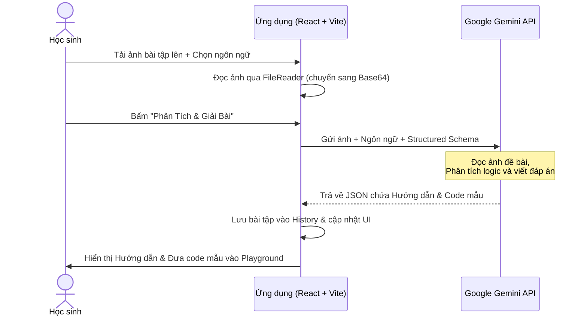
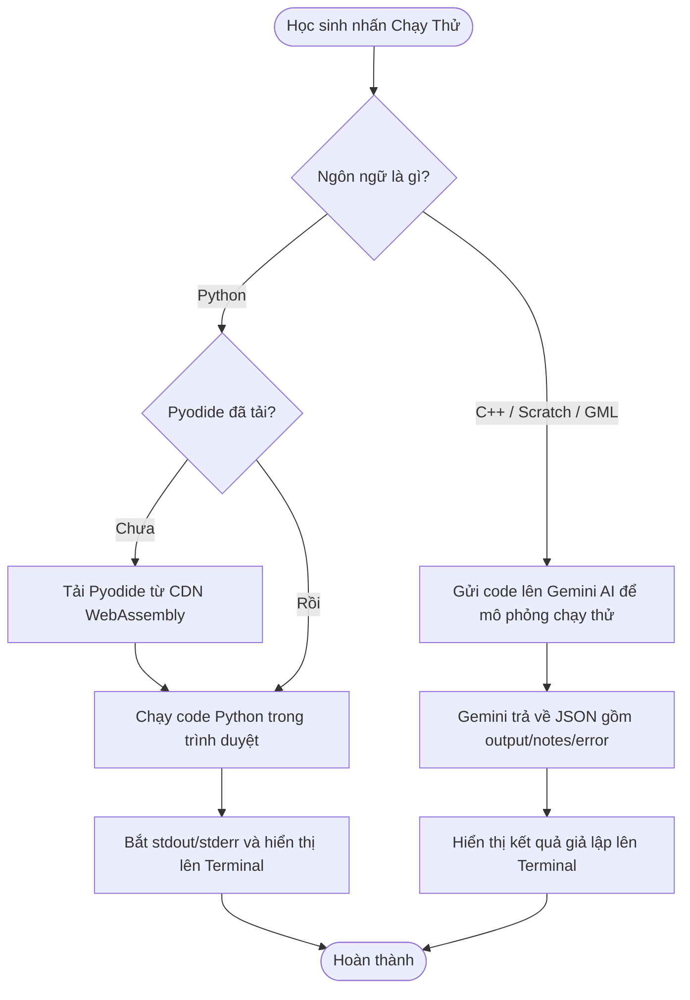

# DANH SÁCH & PHÂN TÍCH CÁC CÔNG NGHỆ SỬ DỤNG

Tài liệu này trình bày chi tiết và rõ ràng về các công nghệ, thư viện, giao thức và giải pháp kỹ thuật được áp dụng trong ứng dụng **Học Dễ Dàng - Trợ Lý Giải Bài Tập AI** sau khi nâng cấp lên kiến trúc hiện đại.

---

## 1. Tổng quan Kiến trúc Ứng dụng
Ứng dụng được xây dựng theo mô hình **Single Page Application (SPA)** chạy hoàn toàn ở phía máy khách (Client-side / Frontend-only) trên nền tảng **Vite** và **React 19**.
*   **Biên dịch trước (Build-time Compilation):** Thay thế cho Babel Standalone dịch code tại thời gian chạy (runtime). Sử dụng Vite để đóng gói và tối ưu tài nguyên trước khi phân phối, giảm thiểu dung lượng file và tăng tốc độ phản hồi.
*   **Không có máy chủ trung gian (Serverless/Backendless):** Các yêu cầu xử lý hình ảnh, gọi AI và chạy thử Python đều được thực thi trực tiếp trên trình duyệt của người dùng.
*   **Lưu trữ dữ liệu cục bộ (LocalStorage DB):** Lưu trữ API Key, danh sách bài tập đã làm, mã nguồn lưu nháp và tiến trình điểm số học tập một cách an toàn dưới trình duyệt của học sinh.

---

## 2. Chi tiết các Công nghệ Frontend & Libraries

| Công nghệ / Thư viện | Phiên bản / Nguồn | Vai trò trong Ứng dụng | Chi tiết kỹ thuật & Lý do sử dụng |
| :--- | :--- | :--- | :--- |
| **React 19** | `v19.2.6` (npm) | Thư viện giao diện chính | Sử dụng cơ chế Virtual DOM của React để quản lý trạng thái (State) tập trung, đồng bộ dữ liệu mượt mà giữa các component độc lập. |
| **Vite** | `v8.0.12` (npm) | Công cụ đóng gói (Bundler) | Cung cấp môi trường dev siêu nhanh với Hot Module Replacement (HMR) và quy trình build tối ưu hóa assets đầu ra. |
| **Tailwind CSS v4** | `v4.3.0` (npm) | Thiết kế giao diện (Styling) | Sử dụng Tailwind CSS thế hệ mới tích hợp trực tiếp qua plugin `@tailwindcss/vite`. Thiết kế giao diện Glassmorphism hiện đại, hỗ trợ chế độ tối (Dark Mode) qua class `dark:`. |
| **React CodeMirror** | `v4.25.10` (npm) | Trình soạn thảo mã nguồn (Code Editor) | Bộ soạn thảo CodeMirror 6 cho React, hỗ trợ đánh số dòng, thụt dòng tự động và các tính năng biên tập nâng cao cho học sinh. |
| **CodeMirror Language Packs** | `@codemirror/lang-*` | Tô màu cú pháp soạn thảo | Gói phân tích cú pháp mã nguồn: `python`, `cpp`, và `javascript` (sử dụng làm fallback cú pháp tương đồng cho GameMaker GML). |
| **Pyodide** | `v0.23.4` (CDN) | Môi trường Python WebAssembly | Biên dịch và thực thi mã nguồn Python trực tiếp trên trình duyệt của học sinh mà không cần máy chủ backend chạy code, đảm bảo tính bảo mật và tức thời. |
| **Scratchblocks** | `v3.6.4` (CDN) | Vẽ khối Scratch trực quan | Quét qua cú pháp văn bản Scratchblocks (ví dụ: `khi lá cờ xanh được click`) và render sang các khối SVG trực quan màu sắc giống Scratch 3.0. |

---

## 3. Trí tuệ Nhân tạo & Giả lập Môi trường Chạy mã

### A. Google Gemini API
*   **Mô hình sử dụng:** `gemini-3.1-flash-lite` - Tối ưu cho các tác vụ đa phương tiện (quét ảnh đề bài), có tốc độ phản hồi rất nhanh và tiết kiệm chi phí.
*   **Truyền tải đa phương tiện:** Mã hóa hình ảnh bài tập thành định dạng Base64 và truyền trực tiếp trong payload HTTP POST đến Google Gemini API.
*   **Structured JSON Output:** Ép kiểu phản hồi của AI tuân thủ cấu trúc JSON cố định bằng cách dùng `responseMimeType: "application/json"` cùng `responseSchema`.
    *   *Schema Phân tích Đề:* Chứa các trường `keyConcepts` (lý thuyết), `stepByStep` (các bước giải), `fullSolution` (đáp án hoàn chỉnh), và `starterCode` (mã nguồn gợi ý).
    *   *Schema Chấm Bài:* Chứa các trường `status` (correct/partial/incorrect), `score` (điểm số từ 0 đến 100), `feedback` (nhận xét chi tiết), và `suggestedFix` (mã nguồn sửa đổi).

### B. Cơ chế Chạy mã nguồn (Execution Engine)
*   **Python:** Khi học sinh bấm **"Chạy Thử"**, hệ thống kiểm tra và tải thư viện Pyodide. Luồng stdout và stderr được bắt lại và chuyển hướng về khung log Terminal cục bộ của ứng dụng.
*   **C++, Scratch, GameMaker:** Việc xây dựng trình biên dịch WebAssembly cho các ngôn ngữ này trên frontend là quá phức tạp và nặng nề. Thay vào đó, ứng dụng sử dụng **AI Simulation Runtime**. Hệ thống gửi mã nguồn kèm hình ảnh bài tập lên Gemini để mô phỏng kết quả chạy console và trả về định dạng log terminal tương ứng.

---

## 4. Các API Trình duyệt Gốc (Native Web APIs)

1.  **FileReader API:** Đọc ảnh tải lên từ máy tính của học sinh và chuyển đổi thành chuỗi Base64.
2.  **Fetch API (với Exponential Backoff):** Gửi yêu cầu HTTP kết nối với Gemini API. Có cơ chế retry tự động lên tới 5 lần khi gặp sự cố nghẽn mạng hoặc quá tải API.
3.  **HTML5 Drag and Drop API:** Hỗ trợ kéo thả ảnh đề bài từ thư mục máy tính trực tiếp vào vùng tải lên.
4.  **Web Storage API (localStorage):**
    *   Lưu trữ API Key cá nhân (`gemini_api_key`).
    *   Lưu trữ theme hiện tại (`theme`: sáng hoặc tối).
    *   Lưu trữ danh sách bài tập đã giải (`homework_history`).

---

## 5. Các Bộ Render Tùy chỉnh (Custom Components)

*   **Custom Markdown Parser:** Hàm `renderSimpleMarkdown` chuyển đổi cấu trúc Markdown, các ký hiệu xuống dòng, ký tự đặc biệt thành thẻ HTML5 tương thích, tạo ra giao diện học tập trực quan dạng các thẻ học tập (cards).
*   **Custom Syntax Highlighter:** Tô màu mã nguồn trong phần đáp án hoàn chỉnh hoặc gợi ý sửa lỗi dựa trên Regex (phân biệt chuỗi, chú thích, số và từ khóa cấu trúc) mà không cần cài đặt thêm thư viện nặng ký.

---

## 6. Sơ đồ Hoạt động của Hệ thống (System Data Flow)

### Sơ đồ Luồng giải bài tập

### Sơ đồ Luồng chạy thử mã nguồn (Execution Flow)

